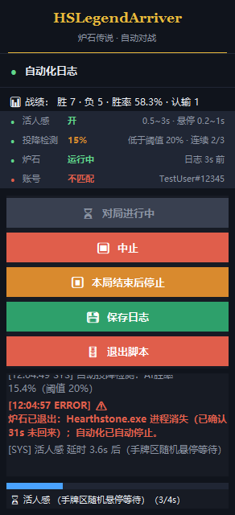

<div align="center">

# 🏆 HSLegendArriver

## 📖 协议
本项目遵循 GPL3.0开源协议 及 禁止商用附加协议

## ⚠️ Disclaimer

本项目仅用于 **技术研究与代码交流**。本团队声明程序不得用于任何违反法律法规及游戏协议的地方，严禁将此开源项目用于商业用途。


**右上角实时日志浮窗**（品牌行 + 状态面板 + 按标签着色的日志 + 延时进度条；告警行红色高亮）




## 🐍 详细安装（含 pip 与清华镜像）

> 需要 **Python 3.12**（自带 pip）。

### 1. 安装 Python 3.12
- 到 <https://www.python.org/downloads/> 下载 **Python 3.12** 安装包（非常重要，当前出现多个安装成3.14导致无法识别的朋友，如果你后续的分辨率都是设置正确，脚本可以正确点击开始游戏但是进入游戏后卡在换牌且AI识别都无法正常工作，必须检查当前python的版本是否为3.12！）；
- 安装时**务必勾选 "Add python.exe to PATH"**；
- 装完在 PowerShell 运行 `python --version` 验证。

### 2. 用清华 TUNA 镜像安装依赖
**请把项目源代码下载到一个没有中文字符的路径下**
**请把项目源代码下载到一个没有中文字符的路径下**
**请把项目源代码下载到一个没有中文字符的路径下**
在项目根目录右键打开 PowerShell，运行：
```text
pip install -r requirements.txt -i https://pypi.tuna.tsinghua.edu.cn/simple
```
依赖较大（含 PaddleOCR / PaddlePaddle），耐心等待。

### 3. 启动
- **以管理员身份**运行：
  win键搜索powershell，右键管理员身份运行，复制项目根目录的**绝对路径**（如果不会请找AI帮忙），输入以下命令
```text
cd 项目根目录
```
powershell进入根目录以后输入

```text
python web_ui.py
```
- 浏览器会自动打开 `http://127.0.0.1:8765`（端口被占用会自动换，以控制台打印为准）。

### 4. 修改电脑分辨率为1920 x 1080；缩放 100%；修改电脑分辨率为1920 x 1080；缩放 100%；修改电脑分辨率为1920 x 1080；缩放 100%；（重要的事情说三遍！！！！）
### 5. 打开炉石传说和炉石盒子
### 6. 炉石设置 → 选项 → 显示 → **显示模式 = 全屏**（**不要用最大化窗口**，详见开头「先看两条最容易忽略的配置」）
### 7. 利用“校准推荐区域”功能对盒子UI的区域进行校正

### 8. 看网页顶部的「🧪 环境自检」

脚本**第一次启动时会自动自检一遍**，结果就在页面顶部的「🧪 环境自检」卡片里，每项一行：✅ 达标、⚠️ 与推荐值不同（还能跑）、❌ 缺失或不满足（**必须修**）。缺依赖会直接给 pip 命令，随时可点 [🔍 重新自检] 重跑。


## 🎯 校准截图区域（适配你本机盒子 UI 大小）

盒子「推荐打法」面板的位置/大小会随**盒子窗口大小、分辨率**不同而变化。首次使用或换了盒子窗口大小后，用画框工具手动校准一次：

1. 网页控制台点「**🎯 校准区域**」卡片里的 [📐 显示校准框（屏幕上）]，或命令行运行 `python calibrate_roi.py`；
2. 屏幕上出现**绿框** = 程序实际截图范围，右下角有**缩放手柄**；
3. 拖右下角手柄调整大小、拖绿框区域整体移动，把盒子面板顶部「**打法参考A**」红头区域框进绿框；
4. 按 **S** 保存（写入 `ui_config.json`，变为蓝框），**Esc** 退出；
5. 保存后重开一局生效。


> 程序固定 **1920×1080、缩放 100%**，如需更大/更小的盒子窗口，重新画框即可。

### 🧭 浮窗「校准」：屏幕上直接看框（不用拖框，先看一眼）

不想开上面那个工具的话，直接在右上角**日志浮窗**点 **「校准」**：屏幕上会叠加显示**脚本实际使用的全部截图区域**，并提示 **「请对齐相应UI」**。

| 画出来的框 / 点 | 对应区域 |
| --- | --- |
| 🟩 绿框 | 盒子推荐面板（OCR 识别来源 `recommendation_roi`）—— 把「打法参考A」面板移进来 |
| 🟦 蓝框 | 换牌「确认」按钮区域（提交校验用） |
| 🟧 橙框 | 盒子「AI胜率」浮动条（自动投降用） |
| 🟥 红细框 | AI胜率兜底区域（主区域读不到时放宽再读一次） |
| ✛ 黄十字 | 阶段判定点（脚本靠这几个像素判断当前是主界面/选牌/对战中） |

顶部提示条还会**实时告诉你绿框里有没有盒子面板**（每 1.5 秒重判一次）：变成绿色「已检测到盒子面板」就说明对齐好了，还是黄色就继续把面板往里拖。

框是**置顶 + 鼠标穿透**的：只是用来看的，点击照常落到炉石上，不影响你操作；**Esc 或再点一次「校准」**收起，关掉浮窗时也会自动消失。


> 图为示意图（假画面 + 真实叠加层），用来展示框的位置与提示条样式。

## 🖥️ 实时日志浮窗（右上角）

自动对局开始时，屏幕**右上角**会出现一个**置顶半透明**小窗（292×628），实时滚动显示自动化日志与当前状态：


## 🛠️ 环境要求

| 项目 | 要求 |
| --- | --- |
| 操作系统 | Windows |
| Python | **3.12（64 位）**——自检会强制这一条：OCR 后端 paddlepaddle 2.6.2 没有 3.13+ 的轮子，3.10/3.11 也不在本项目实测范围内 |
| 炉石传说 | 已安装 |
| 炉石盒子 | 已安装，简体中文 |
| 桌面 / 炉石分辨率 | **1920 × 1080** |
| Windows 缩放 | **100%** |

## 🧪 环境自检

**第一次启动脚本会自动自检一遍**，之后随时可在网页顶部「🧪 环境自检」卡片点 [🔍 重新自检]。明细列表**可以收起**（点卡片右上角「收起」，选择会记在浏览器里；一旦有 ❌ 会自动展开，不会把问题藏起来）。

| 检查项 | 怎么判 |
| --- | --- |
| Python 版本 | 必须 **3.12 的 64 位**：装了别的版本（尤其 3.13/3.14）会直接判 ❌ 并给出建环境命令 |
| 依赖包 | 逐个 import 一遍，并和 `requirements.txt` 的版本比对；缺哪个直接给 `pip install` 命令 |
| 管理员权限 | 不是管理员 → 鼠标/键盘点击会被系统拦掉（现象就是「脚本在跑但点了没反应」） |
| 屏幕分辨率 / 缩放 | 必须是 **1920×1080 / 100%**，否则硬编码坐标会整体偏移 |
| 炉石窗口 | 没开只算 ⚠️（点「开始运行」会先拉起战网和炉石） |
| 炉石日志目录 | 目录不存在算 ❌；目录在但还没有 Power.log 只算 ⚠️（打一局就有了） |
| OCR 模型目录 | 没下载只算 ⚠️，首次识别会自动下载 |

结论会同时写进控制台日志（❌/⚠️ 逐条带修复提示），自动化出问题前的第一步排查就从这里看。

## ⚠️ 启动前检查

- [ ] 盒子推荐打法位于屏幕左侧
- [ ] 桌面 / 炉石分辨率均为 **1920 × 1080**，Windows 缩放 **100%**
- [ ] 炉石显示模式为 **全屏**（`设置 → 选项 → 显示`），**没有**使用「最大化窗口」
- [ ] 「用户 ID」填的是**当前账号的完整战网昵称（含 #编号）**——换过账号一定要同步改
- [ ] 网页「🧪 环境自检」里没有 ❌（Python 3.12、依赖、管理员权限、分辨率全绿）
- [ ] 用浮窗「校准」确认盒子面板落在绿框内（提示条变成绿色「已检测到盒子面板」）
- [ ] 炉石盒子使用**简体中文**，左侧「推荐打法」完整显示
- [ ] 炉石 / 炉石盒子窗口未被其他窗口遮挡
- [ ] 使用**管理员权限**启动 Python，`HEARTHSTONE_LOG_ROOT` / `YOUR_NAME` 配置正确
- [ ] 「🩺 存活检测」保持开启（默认开启），避免炉石闪退后无人值守空转

## 🤝 Contributing

如果你在使用过程中遇到问题，或想反馈 Bug / 功能建议，欢迎在 Issue 中提供：问题现象 + 游戏界面截图 + 运行环境。

## ⭐

如果你觉得这个项目有意思或帮到了你，欢迎点一个 **Star ⭐**，这对我真的很重要！


---

## 🙏 致谢

本项目参考了以下开源项目：

- [Yiyuan-Dong/AutoHS](https://github.com/Yiyuan-Dong/AutoHS)
- [FallAbyss/AutoHS](https://github.com/FallAbyss/AutoHS)
## 交流方式


---

<div align="center">

### 🏆 HSLegendArriver


<a href="https://www.star-history.com/?repos=magicstrangelzb%2Fhearthstonelegendarriver&type=date&legend=top-left">
 <picture>
   <source media="(prefers-color-scheme: dark)" srcset="https://api.star-history.com/chart?repos=magicstrangelzb/hearthstonelegendarriver&type=date&theme=dark&legend=top-left" />
   <source media="(prefers-color-scheme: light)" srcset="https://api.star-history.com/chart?repos=magicstrangelzb/hearthstonelegendarriver&type=date&legend=top-left" />
   
 </picture>
</a>

## ⭐ Star 一下吧 ⭐

</div>
